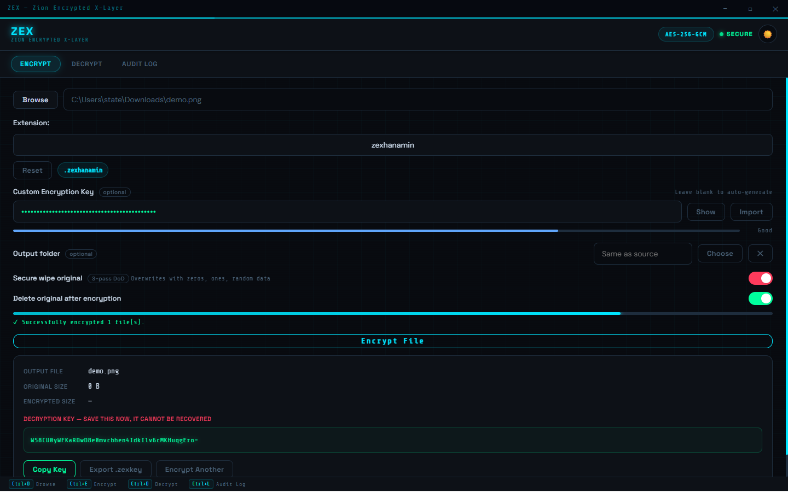
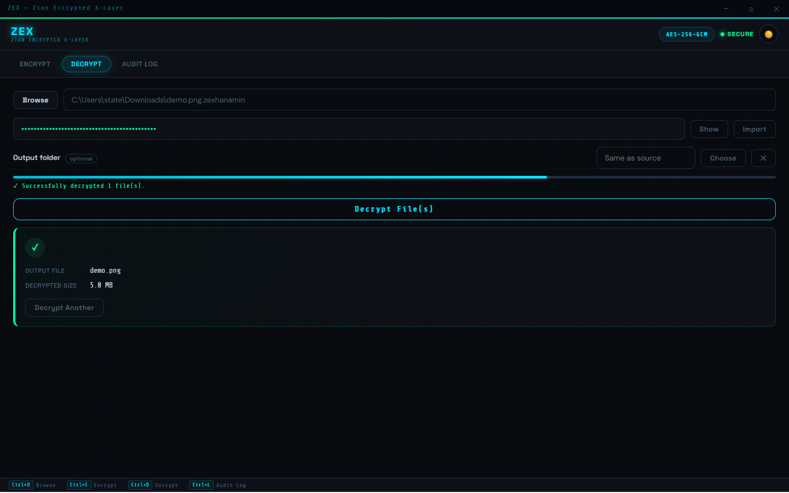

<div align="center">

# ZEX — Zion Encrypted X-Layer

**Military-grade AES-256-GCM file encryption. Desktop. Offline. Open Source.**

[](LICENSE)
[]()
[](https://www.electronjs.org/)
[]()

</div>

---

## What is ZEX?

ZEX is a lightweight, offline desktop application for encrypting and decrypting files using **AES-256-GCM** — the same standard used by governments and security professionals worldwide. No cloud, no accounts, no tracking. Your files never leave your machine.

---

## Features

- **AES-256-GCM Encryption** — authenticated encryption with 256-bit keys
- **Multi-file support** — encrypt or decrypt multiple files at once
- **Custom key support** — bring your own Base64 key or auto-generate one
- **Key export / import** — save keys as `.zexkey` files
- **Secure wipe** — 3-pass DoD overwrite of original files
- **Audit log** — full history of all encrypt/decrypt operations
- **Custom output folder** — choose where encrypted files are saved
- **Custom extension** — default `.zex`, fully configurable
- **Dark / Light theme** — clean minimal UI, both modes
- **Frameless window** — custom title bar, fully resizable
- **100% offline** — no internet required, ever

---

## Screenshots

> Add screenshots here after first release.



---

## Getting Started

### Prerequisites

- [Node.js](https://nodejs.org/) v18 or higher
- [Git](https://git-scm.com/)

### Installation

```bash
# Clone the repository
git clone https://github.com/YOUR_USERNAME/zex.git

# Navigate into the project
cd zex

# Install dependencies
npm install

# Start the app
npm start
```

### Build (Windows Installer)

```bash
npm run build
```

Output will be in the `dist/` folder as a `.exe` installer.

---

## Project Structure

```
zex/
├── main.js              # Electron main process — window, IPC handlers
├── preload.js           # Context bridge — secure renderer ↔ main communication
├── crypto-engine.js     # AES-256-GCM encryption/decryption engine
├── package.json         # Project config and build settings
├── renderer/
│   ├── index.html       # App UI
│   ├── renderer.js      # Frontend logic
│   └── style.css        # Styling — dark/light themes
└── assets/
    └── icon.ico         # App icon
```

---

## How It Works

```
ENCRYPT
  Input file
    → Generate / validate 256-bit key
    → Random 16-byte IV generated
    → AES-256-GCM cipher stream
    → Output: IV (16B) + AuthTag (16B) + Ciphertext
    → Save as <filename>.<ext>

DECRYPT
  Encrypted file
    → Read IV + AuthTag from header (first 32 bytes)
    → AES-256-GCM decipher with provided key
    → GCM auth tag verified (tamper detection)
    → Original file restored
```

---

## Security Notes

- Keys are **never stored** by the application — you must save them yourself
- GCM auth tag verification means any **tampered file will fail** decryption
- Secure wipe uses **3-pass DoD 5220.22-M** standard (zeros → ones → random)
- All operations are **100% local** — no telemetry, no network calls

---

## Tech Stack

| Layer | Technology |
|---|---|
| Runtime | Electron.js |
| Crypto | Node.js `crypto` (AES-256-GCM) |
| Frontend | HTML, CSS, Vanilla JS |
| Packaging | electron-builder |
| Platform | Windows (Linux/macOS support planned) |

---

## Contributing

Contributions are welcome. Please open an issue first to discuss what you'd like to change.

1. Fork the repo
2. Create a feature branch (`git checkout -b feature/your-feature`)
3. Commit your changes (`git commit -m 'Add: your feature'`)
4. Push to the branch (`git push origin feature/your-feature`)
5. Open a Pull Request

---

## License

This project is licensed under the **MIT License** — see the [LICENSE](LICENSE) file for details.

---

<div align="center">
  <sub>Built with ♥ — Department of Information Security · Section 3M · 4th Semester</sub>
</div>
